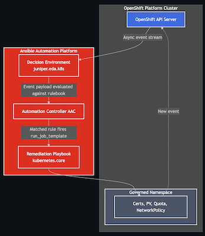

# Custom Decision Environment for Event-Driven Ansible for OpenShift

## Introduction

This repository contains everything needed to build, configure, and operate a **Custom Decision Environment (DE)** for Ansible Event-Driven Automation (EDA) for OpenShift.

A Decision Environment is a container image that packages the Ansible EDA runtime, event source plugins, Python dependencies, and system libraries needed to execute rulebooks in the Ansible Automation Platform (AAP) Decision Controller. This repository provides a **custom DE** that extends the Red Hat supported base image with the [Juniper k8s.eda](https://github.com/Juniper/k8s.eda) event source plugin — enabling real-time Kubernetes and OpenShift resource event streaming directly into EDA rulebooks.

This is the **infrastructure backbone** for the EDA governance layer described in the Namespace as a Service platform. When a namespace is labelled `eda-governed=true` at provisioning time, it is this Decision Environment and its rulebooks that watch the cluster and trigger remediation automatically.

-----

> [!WARNING]
> 
> ## Prerequisites
> We will be using a CI from Red Hat Demo to provide us the baseline Infrastrature.  
>  1) [Ansible 2.6 with EDA](https://catalog.demo.redhat.com/catalog/babylon-catalog-prod?item=babylon-catalog-prod/enterprise.aap-product-demos-cnv-aap25.prod&utm_source=webapp&utm_medium=share-link)  
>  2) Access to an **OpenShift cluster 4.18+** with cluster-admin or equivalent permissions  
>  3) The `oc` CLI authenticated to your OpenShift cluster  
>  5) A container registry accessible from your AAP instance (e.g. Quay, OpenShift internal registry) -- Optional
> 

-----

## Repository Structure

|Path                      |Purpose                                                                                                  |
|--------------------------|---------------------------------------------------------------------------------------------------------|
|[rulebooks/](rulebooks)              |EDA rulebooks — event source configuration and rules that map cluster events to AAC job templates        |
|[playbooks/](playbooks)              |Ansible playbooks — remediation logic executed by AAC when a rulebook rule fires                         |
|[custom_credential_type](content/custom_credential_type)/  |Custom credential type definitions — extends AAP with OpenShift token and EDA-specific credential schemas|
|[rbac](content/rbac)/                    |OpenShift RBAC manifests for EDA and AAC — ClusterRole, ServiceAccount, ClusterRoleBinding, and token Secret             |
|[decision_environment/](content/decision_environment)              |Images used to create this workshop                       |
|[execution_environment/](content/execution_environment)              |Images used to create this workshop                       |
|[Images/](content/Images)              |Images used to create this workshop                       |

-----

## Goals and Objectives

### Goals

1. **Enable real-time cluster governance** — move from periodic polling to event-driven reactions to cluster state changes using a custom EDA Decision Environment with the Juniper k8s event source.
1. **Bridge EDA and AAC cleanly** — rulebooks in this repo do not contain remediation logic themselves; they fire AAC job templates. This keeps decision logic (EDA) and execution logic (AAC + playbooks) cleanly separated.

### Objectives

By working through this repository, you will be able to:

- Build and publish a custom EDA Decision Environment image using `ansible-builder`
- Register the DE in AAP Automation Decisions
- Configure the required OpenShift RBAC objects so EDA can authenticate and watch resources
- Import and activate EDA credential types for OpenShift token-based authentication
- Activate a rulebook in AAP that streams live events from OpenShift
- Understand how the `kubeconfig` credential projection works in AAP
- Trigger and verify remediation playbooks via AAC job templates

-----

## Architecture

-----

## Further Reading

- [Ansible EDA documentation](https://www.ansible.com/products/event-driven-ansible)
- [ansible-builder documentation](https://ansible.readthedocs.io/projects/builder/en/latest/)
- [Juniper k8s.eda collection](https://github.com/Juniper/k8s.eda)
- [kubernetes_asyncio Python library](https://github.com/tomplus/kubernetes_asyncio)
- [AAP Decision Environments](https://docs.redhat.com/en/documentation/red_hat_ansible_automation_platform/latest/html/using_automation_decisions)
- [OpenShift RBAC documentation](https://docs.openshift.com/container-platform/latest/authentication/using-rbac.html)
